# WildLifeX

### Interactive Wildlife Learning and Ecosystem Simulator

WildLifeX is a full-stack educational web platform that combines a scientific wildlife encyclopedia with an interactive, real-time ecosystem simulator.

The platform allows users to explore wildlife species, construct virtual ecosystems, introduce different species and environmental elements, and observe how populations and ecological relationships evolve over time.

The system combines wildlife education with agent-based simulation, autonomous animal behaviour, predator-prey interactions, reproduction, environmental conditions, population dynamics, and ecosystem analysis.

---

## Overview

WildLifeX was developed as an academic capstone project for the Higher National Diploma in Information Technology (HNDIT).

The project was designed to address the limitations of static approaches to teaching ecological concepts. Instead of relying exclusively on textbook diagrams and theoretical explanations, WildLifeX provides an interactive environment where users can experiment with ecological scenarios and observe their consequences.

Users can investigate questions such as:

* What happens when an ecosystem has too many herbivores?
* What happens when predators disappear?
* How does food availability affect population growth?
* What happens when an animal is introduced into an incompatible habitat?
* How can environmental conditions affect ecosystem stability?

The resulting changes are simulated in real time within an HTML5 Canvas environment.

---

## Project Objectives

* Develop an interactive wildlife encyclopedia containing scientific and ecological information.
* Create a real-time agent-based ecosystem simulation capable of handling hundreds of autonomous entities.
* Model biological characteristics including hunger, hydration, energy, health, age, gender, reproduction, and mortality.
* Simulate predator-prey relationships and population dynamics.
* Demonstrate ecological phenomena such as carrying capacity, overgrazing, trophic cascades, and extinction.
* Provide interactive tools for constructing and manipulating virtual ecosystems.
* Implement cloud-based persistence for saving and restoring simulation states.
* Maintain a responsive user interface while executing high-frequency simulation and rendering operations.

---

# Screenshots

## Landing Page

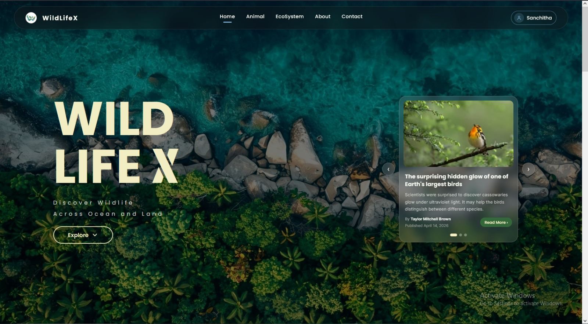

The landing page introduces the platform and provides access to the wildlife catalogue, ecosystem simulator, project information, and community features.

## Wildlife Catalogue

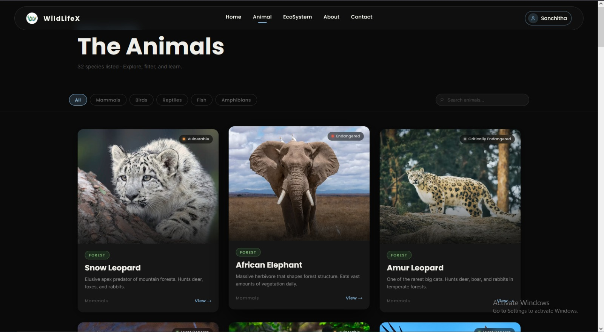

The wildlife catalogue provides searchable and filterable access to the configured species database.

The current system contains 28 species across mammals, birds, reptiles, fish, amphibians, and invertebrates.

## Animal Details

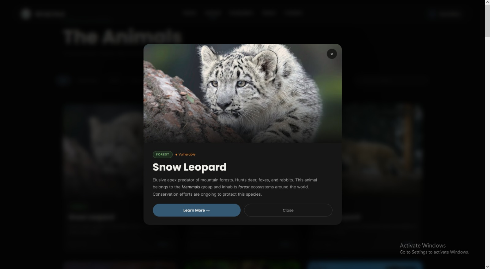

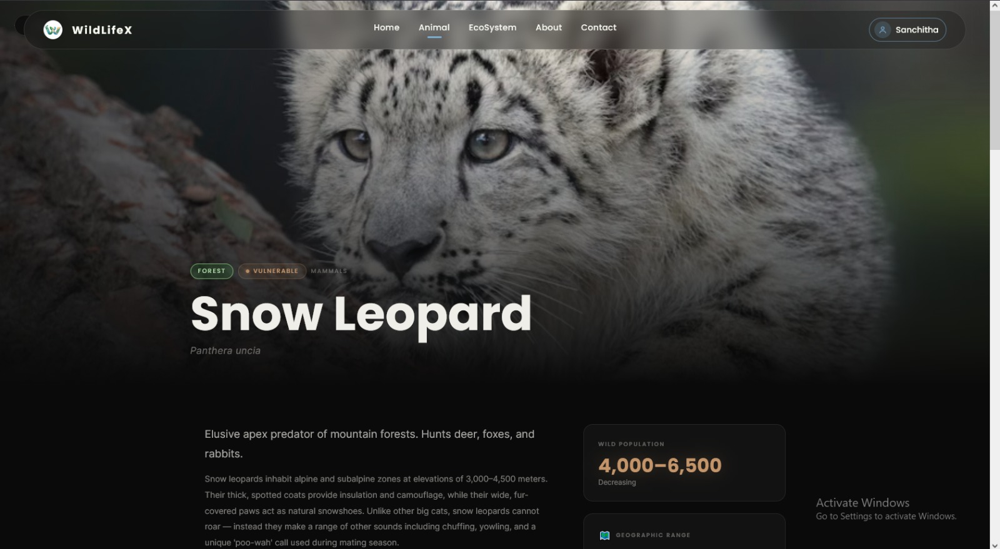

Species profiles provide scientific and ecological information including:

* Scientific name
* Taxonomic category
* Habitat
* Conservation status
* Diet
* Lifespan
* Speed
* Weight
* Predator relationships
* Prey relationships
* Wildlife photography

## Platform Features

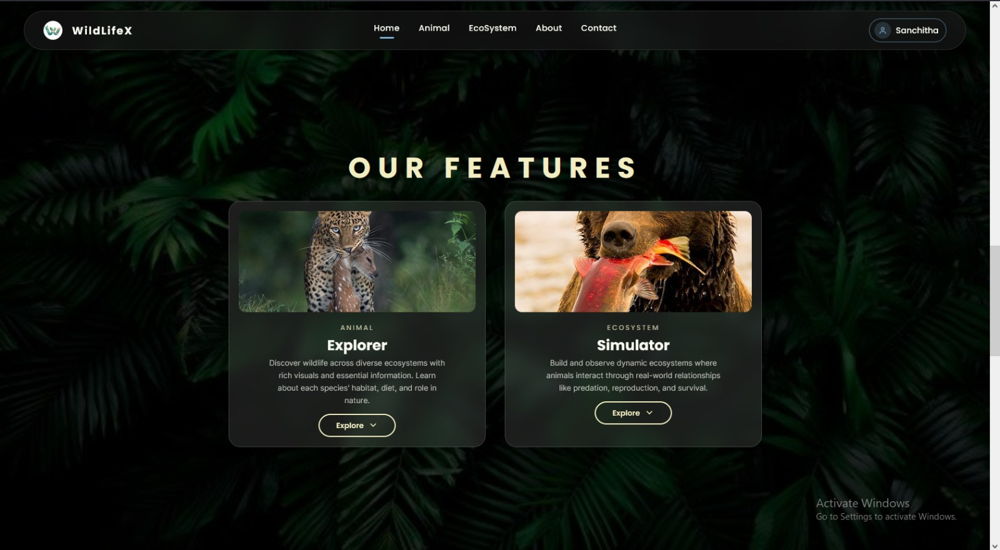

The platform combines wildlife reference information with interactive simulation and ecosystem management features.

## Ecosystem Selection

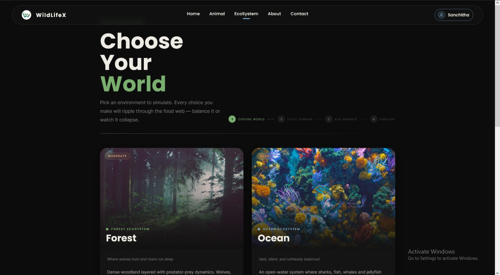

Users can select between the currently available Forest and Ocean environments.

Each biome contains its own environmental conditions, flora, fauna, climate behaviour, and ecological hazards.

## Ecosystem Configuration

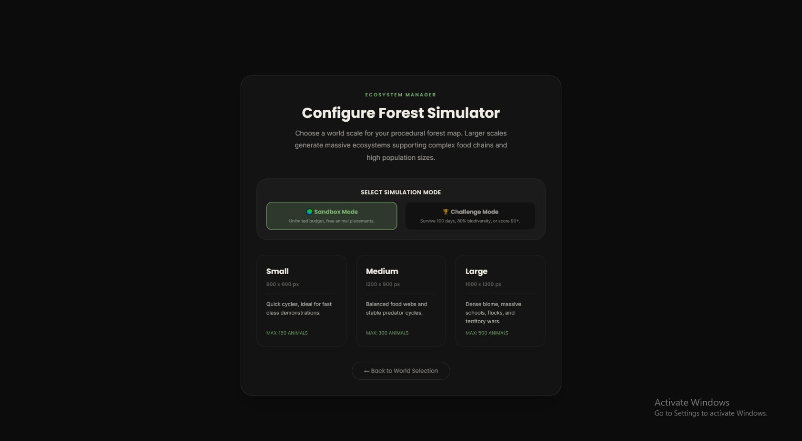

Users can configure the simulation world before entering the ecosystem.

Available map sizes are:

| Size   |  Dimensions | Maximum Animals |
| ------ | ----------: | --------------: |
| Small  |   800 × 600 |             150 |
| Medium |  1200 × 900 |             300 |
| Large  | 1600 × 1200 |             500 |

Two simulation modes are available:

### Sandbox

Provides unlimited ecosystem points for unrestricted experimentation.

### Challenge

Starts with 180 ecosystem points. The objective is to maintain ecosystem stability and survive 100 simulation days without three species becoming extinct.

## Ecosystem Simulation

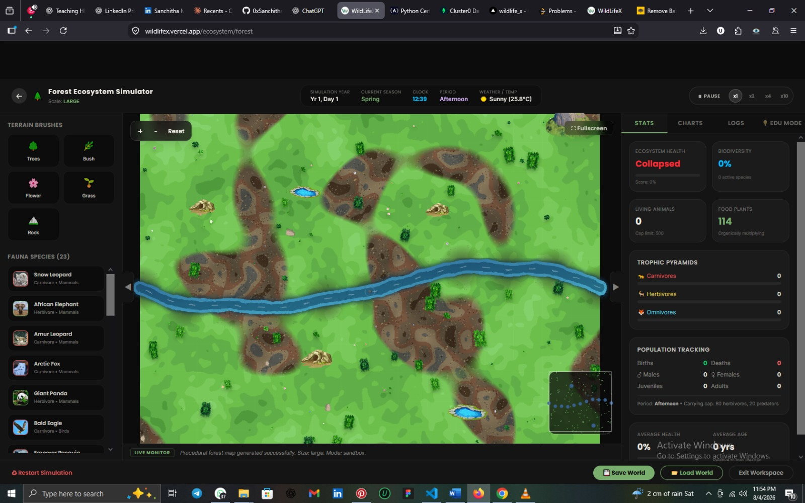

The simulation workstation provides a real-time Canvas environment with animal placement, environmental objects, simulation controls, telemetry, weather information, and ecosystem analytics.

Users can:

* Place animals and environmental elements
* Pan around the simulation world
* Zoom using cursor-centered controls
* Follow individual animals
* Inspect entities
* Pause the simulation
* Accelerate simulation time
* Monitor population statistics
* Observe weather and seasonal conditions
* Save and restore ecosystems

Simulation speed can be configured between:

```text
Pause | 1x | 2x | 4x | 10x
```

## Authentication

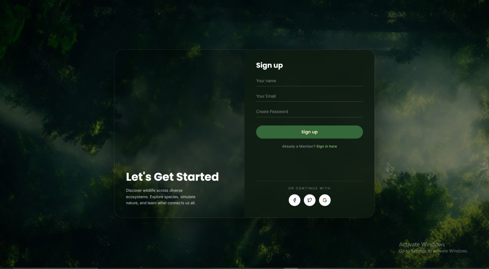

The authentication interface provides account registration and sign-in functionality for protected platform features.

## User Profile

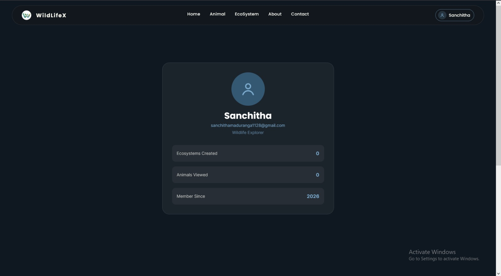

The profile page displays authenticated account information and platform usage statistics.

## Contact and Reviews

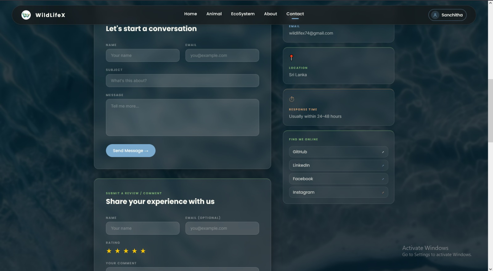

The contact interface allows users to submit inquiries and provide ratings and feedback.

---

# Core Features

## Wildlife Encyclopedia

The animal database contains 28 configured species with information including:

* Scientific classification
* Habitat
* Conservation status
* Diet
* Lifespan
* Speed
* Weight
* Predator relationships
* Prey relationships
* Ecosystem placement cost
* High-resolution imagery

The database supports mammals, birds, reptiles, fish, amphibians, and invertebrates.

---

# Ecosystem Simulation

The simulation engine is implemented in JavaScript and operates independently from the React component tree.

This separation prevents high-frequency simulation updates from unnecessarily re-rendering the application interface.

The simulation uses `requestAnimationFrame` for rendering and clamps delta time to prevent unstable large time steps when browser activity is interrupted.

React telemetry updates are throttled to approximately 5 Hz while Canvas rendering continues independently.

---

# Animal Agent System

Each simulated animal is represented as an autonomous agent with biological and behavioural properties.

### Biological Attributes

Agents maintain:

* Health
* Hunger
* Hydration
* Energy
* Age
* Gender
* Life stage
* Parent relationships
* Children relationships
* Habitat compatibility
* Sensory ranges

Animals progress through the following life stages:

```text
Juvenile → Teen → Adult → Old
```

Old-age mortality is introduced when animals reach their configured lifespan.

Dead animals remain temporarily within the ecosystem as carcasses, allowing scavengers and carnivores to consume them before decomposition removes them.

---

# Behaviour System

Animal behaviour is controlled through a priority-based state machine.

The primary states are:

```text
Flee
Sleep
Seek Water
Seek Food
Hunt
Graze
Seek Mate
Roam
```

Animals continuously evaluate their current biological needs and environmental conditions to determine their next state.

For example, fleeing from a predator has higher priority than searching for food.

The system uses:

* Vision radius
* Smell radius
* Hearing radius
* Hunger
* Hydration
* Energy
* Health
* Age
* Habitat compatibility
* Environmental conditions

to influence behavioural transitions.

---

# Flocking and Herd Behaviour

Social species use a Boids-inspired steering system based on three primary forces:

### Separation

Reduces crowding between nearby agents.

### Alignment

Encourages neighbouring agents to travel in similar directions.

### Cohesion

Encourages agents to remain close to the local centre of their group.

This produces emergent herd and flock behaviour for suitable species.

---

# Predator-Prey System

The simulation uses configured predator and prey relationships to determine valid hunting targets.

When a predator detects suitable prey:

1. The predator identifies a valid target.
2. The predator enters pursuit behaviour.
3. The predator accelerates during the chase.
4. The prey enters flee behaviour.
5. The prey attempts to escape or use obstacles.
6. The predator attacks when it reaches the target.
7. The prey becomes a carcass.
8. The predator receives hunger and energy benefits.
9. The event is recorded in the simulation log.

Carnivores and omnivores can also detect and consume carcasses before decomposition.

---

# Reproduction and Life Cycle

Reproduction is based on biological prerequisites and sex-based mating.

Both animals must satisfy conditions relating to:

* Age
* Health
* Hunger
* Hydration
* Species
* Gender
* Reproduction cooldown

Forest reproduction is additionally affected by seasonal conditions.

Successful mating creates a gestation period before offspring are generated.

Offspring are created as juvenile agents and maintain parent-child relationships through:

```text
parentIds
childrenIds
```

The system also provides warnings when a population contains a fertile adult but no compatible opposite-sex partner.

---

# Extinction Detection

The simulation continuously tracks the living population of every active species.

When the population of a species reaches zero, the species is registered as extinct.

The diagnostic system attempts to determine contributing ecological conditions, including:

* Predator pressure
* Food shortages
* Overgrazing
* Habitat incompatibility
* Extreme weather
* Population imbalance
* Reproductive failure

These causes are communicated through the simulation's educational event and dynamics systems.

In Challenge Mode, extinction of three species results in an ecosystem collapse state.

---

# Ecosystem Balance

WildLifeX calculates an ecosystem balance score between 0 and 100.

The calculation considers factors such as:

* Predator-to-herbivore ratio
* Plant-to-herbivore ratio
* Average population health
* Biodiversity
* Carrying capacity
* Food availability
* Population distribution

### Balance Classification

|    Score | Classification |
| -------: | -------------- |
|   85–100 | Excellent      |
|    60–84 | Balanced       |
|    30–59 | Unstable       |
| Below 30 | Collapsed      |

The system can identify conditions including:

* Trophic collapse
* Overpopulation cascades
* Overgrazing
* Predator starvation
* Population imbalance

---

# Ecosystems

## Forest

The Forest biome contains:

* Procedurally generated terrain
* Grass and soil variation
* Rivers
* Freshwater ponds
* Mountains
* Rocks
* Trees
* Bushes
* Flowers
* Reeds
* Caves
* Hollow logs

### Seasons

```text
Spring → Summer → Autumn → Winter
```

### Weather

* Sunny
* Rainy
* Stormy
* Heatwave
* Cold Wave
* Snow

### Environmental Hazards

* Wildfires
* Drought
* Disease outbreaks
* Floods

## Ocean

The Ocean biome contains:

* Shallow coral reef shelves
* Open water
* Deep ocean areas
* Kelp beds
* Seagrass meadows
* Coral formations
* Underwater current effects
* Bubble effects

### Sea Seasons

```text
Tropical Wet → Tropical Dry
```

### Environmental Hazards

* Oil spills
* Plastic waste
* Hurricane storm surges
* Deep cold waves

---

# Ecosystem Builder

The ecosystem builder allows users to construct simulation environments before starting the simulation.

### World Configuration

Users can select:

* Biome
* Map size
* Simulation mode
* Species
* Environmental elements

### Placement System

The placement system supports:

* Animals
* Trees
* Bushes
* Flowers
* Rocks
* Mountains
* Kelp
* Coral
* Other biome-specific elements

### Placement Validation

The engine performs:

* Overlap detection
* Habitat validation
* Species placement validation
* Herd and pack positioning

When a species is placed into an incompatible biome, the system marks the agent as incompatible and applies health decay while providing an educational warning.

---

# Algorithms and Technical Systems

WildLifeX incorporates several algorithms and custom systems to support its simulation.

## Spatial Hash Grid

A two-dimensional spatial hash grid divides the simulation world into 80-pixel cells.

Instead of comparing every entity with every other entity, agents query nearby spatial cells.

This reduces unnecessary checks for:

* Collision detection
* Sensory queries
* Neighbour detection
* Herd behaviour
* Predator detection

and provides a significant improvement over naive pairwise comparisons.

## Boids Steering

The flocking system combines separation, alignment, and cohesion vectors to generate group movement.

## Simplex Noise

A procedural Simplex Noise implementation generates continuous environmental variation for terrain and vegetation.

It is used for effects such as:

* Soil variation
* Grass patterns
* Terrain gradients
* River surroundings

## Deterministic Pseudo-Random Generation

The simulation uses `cyrb128` together with `sfc32` to create reproducible seed-based pseudo-random generation.

This allows simulation environments to be generated consistently from the same seed.

## Obstacle Avoidance

Agents use steering vectors and distance-based heuristics to avoid obstacles and identify suitable hiding locations.

## Lotka-Volterra-Inspired Dynamics

Predator-prey population behaviour is influenced by rate-based dynamics inspired by the Lotka-Volterra model.

This contributes to population oscillation, predation, and famine behaviour.

## Rolling Time-Series Analysis

The engine maintains a rolling buffer of recent simulation measurements for real-time trend visualization.

Tracked metrics include:

* Population
* Trophic balance
* Climate
* Ecosystem conditions

---

# Technical Architecture

# Technical Architecture

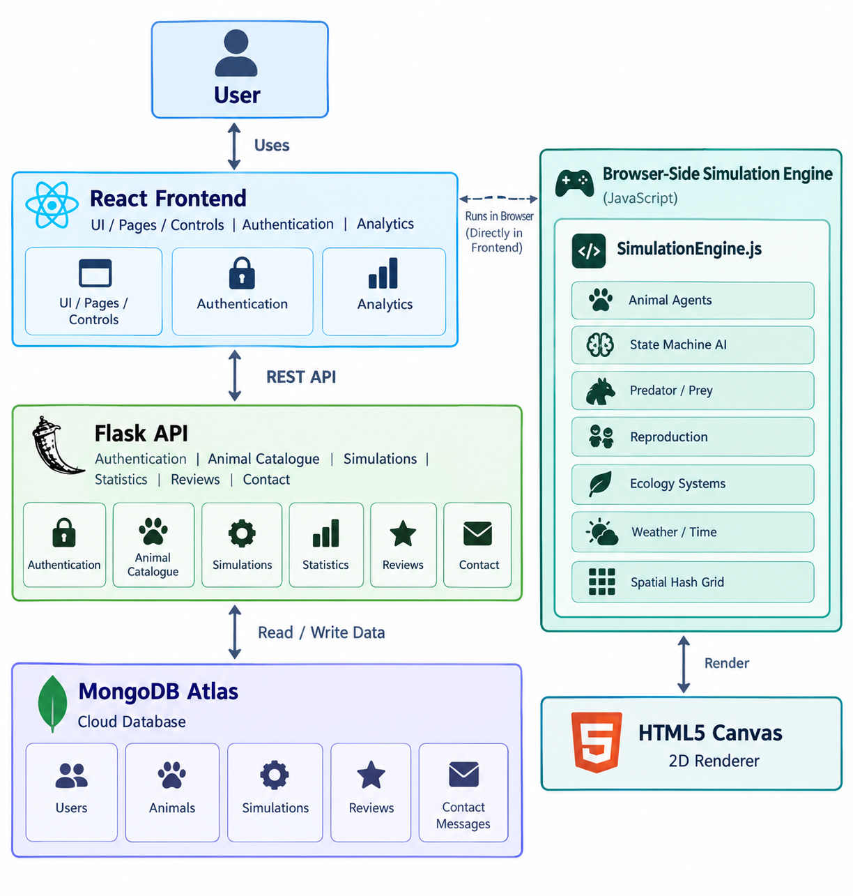

The simulation engine operates independently from React's component tree.

This architecture allows the high-frequency simulation and Canvas rendering system to operate separately from the application's user interface and telemetry updates.

---

# Frontend

| Technology         | Purpose                          |
| ------------------ | -------------------------------- |
| React 19           | User interface                   |
| Vite               | Development and build tooling    |
| React Router DOM 7 | Client-side routing              |
| Tailwind CSS 4     | Styling                          |
| JavaScript         | Application and simulation logic |
| HTML5 Canvas       | Simulation rendering             |
| Motion             | UI animations                    |
| Lucide React       | Icons                            |
| React Icons        | Additional iconography           |

The Canvas renderer provides:

* Sprite caching
* Camera transformations
* Cursor-centred zoom
* Pan boundaries
* Follow-camera functionality
* Z-order rendering
* Day/night overlays
* Lighting transitions
* Entity rendering

---

# Backend

| Technology    | Purpose                    |
| ------------- | -------------------------- |
| Python        | Backend language           |
| Flask         | REST API                   |
| Gunicorn      | Production WSGI server     |
| Flask-CORS    | Cross-origin communication |
| PyJWT         | JWT authentication         |
| bcrypt        | Password hashing           |
| python-dotenv | Environment configuration  |
| smtplib       | Email notifications        |

The Flask backend is organized into modular blueprints:

```text
/api/auth
/api/animals
/api/simulations
/api/stats
/api/contact
/api/reviews
```

---

# Database

WildLifeX uses MongoDB Atlas as its cloud database and PyMongo for database communication.

### Collections

| Collection       | Purpose                               |
| ---------------- | ------------------------------------- |
| users            | User accounts and authentication data |
| animals          | Wildlife species information          |
| simulations      | Saved ecosystem states                |
| reviews          | User ratings and feedback             |
| contact_messages | Contact inquiries                     |

Saved simulation documents contain information such as:

```text
user_id
name
ecosystem_type
world_size
simulation_state
created_at
updated_at
```

---

# Authentication and Security

WildLifeX uses stateless JSON Web Token authentication.

### Authentication Flow

```text
User
  |
  v
Sign Up / Sign In
  |
  v
bcrypt Password Verification
  |
  v
JWT Token
  |
  v
Authenticated Requests
  |
  v
Flask Token Verification
```

Passwords are protected using salted bcrypt hashing.

JWT tokens use HS256 signing and have a seven-day expiration period.

Protected simulation and profile routes require authentication.

---

# Application Pages

| Page                | Route                | Description                                     |
| ------------------- | -------------------- | ----------------------------------------------- |
| Home                | `/`                  | Platform introduction and community information |
| Animals             | `/animal`            | Searchable wildlife catalogue                   |
| Animal Details      | `/animal/:id`        | Detailed species information                    |
| Ecosystem Selector  | `/ecosystem`         | Environment selection                           |
| Ecosystem Simulator | `/ecosystem/:type`   | Ecosystem construction and simulation           |
| About               | `/about`             | Project information and technology overview     |
| Contact             | `/contact`           | Contact and review functionality                |
| Profile             | `/profile`           | User account information                        |
| Authentication      | `/signin`, `/signup` | Registration and sign-in                        |

---

# Testing

WildLifeX includes automated API integration tests and interactive simulation testing.

### API Testing

The simulation API tests cover:

* JWT authentication
* Simulation creation
* Simulation persistence
* Simulation listing
* Simulation deserialization
* Simulation updates
* Simulation deletion

### Database Seeding

The animal seeding system verifies:

* Species records
* Predator-prey relationships
* Ecosystem point costs
* Database upsert operations

### Interactive Simulation Testing

The simulation has been tested for:

* Boundary collisions
* Canvas panning
* Zoom behaviour
* Sprite caching
* Habitat incompatibility
* Entity placement
* Simulation interactions

---

# Deployment

WildLifeX uses a cloud-based deployment architecture.

| Component | Platform      |
| --------- | ------------- |
| Frontend  | Vercel        |
| Backend   | Railway       |
| Database  | MongoDB Atlas |

### Frontend

The React/Vite application is deployed through Vercel with Git-based continuous deployment.

### Backend

The Flask application is deployed on Railway using Gunicorn.

Production backend:

`https://wildlifex-production-7a43.up.railway.app`

### Database

MongoDB Atlas provides the managed cloud database used by the production application.

---

# Performance

The simulation is designed to support large numbers of autonomous entities while maintaining responsive rendering.

Key performance techniques include:

* Spatial hash grid partitioning
* Independent simulation engine
* Canvas-based rendering
* Sprite caching
* Delta-time clamping
* Throttled React telemetry
* Efficient neighbour queries

Large simulation worlds support up to approximately 500 simultaneous animal entities.

---

# Limitations

### Steering-Based Navigation

The current navigation system uses vector steering and obstacle avoidance rather than full A* pathfinding.

This can occasionally result in agents moving along obstacle boundaries.

### 2D Rendering

The simulator currently uses top-down 2D Canvas rendering rather than 3D or WebGL-based environments.

### Desktop-Focused Controls

The simulation is primarily optimized for mouse interaction, including zooming, panning, following entities, and inspection.

Touch-based interaction on smaller mobile screens is currently less intuitive.

### Client-Side Simulation

The simulation engine runs in the user's browser.

Older devices may experience reduced performance when simulating large numbers of agents simultaneously.

---

# Future Development

### Additional Biomes

Planned ecosystems include:

* Arctic Tundra
* Arid Desert
* Tropical Rainforest

### Reinforcement Learning

Future versions could introduce neural-network-based agents capable of learning hunting and evasive behaviours through reinforcement learning rather than relying exclusively on predefined behavioural rules.

### Genetic Evolution

Future iterations could introduce heritable characteristics such as:

* Speed
* Size
* Vision range
* Camouflage

allowing traits to change across successive generations.

### Multiplayer Simulation

WebSocket-based collaborative simulation rooms could allow multiple learners to interact with the same ecosystem in real time.

### Dynamic Audio

Biome-aware procedural soundscapes could introduce:

* Wind
* Ocean waves
* Bird calls
* Animal vocalizations
* Weather sounds

with audio changing according to environment and time of day.

---

# Results

WildLifeX successfully combines an educational wildlife catalogue with a real-time ecological simulation engine.

The implemented system provides:

* 28 configured wildlife species
* 2 interactive biomes
* Up to 500 animal entities on large maps
* Autonomous agent behaviour
* Predator-prey interactions
* Reproduction and life cycles
* Extinction detection
* Ecosystem balance analysis
* Dynamic weather
* Seasonal conditions
* Environmental hazards
* Cloud-based simulation persistence
* JWT authentication
* Real-time analytics
* Full-stack cloud deployment

The project demonstrates the integration of modern web development with simulation programming, algorithmic agent behaviour, data persistence, and interactive educational systems.

---

# Academic Context

WildLifeX was conceived, designed, developed, tested, and deployed as a solo academic capstone project for the:

**Higher National Diploma in Information Technology (HNDIT)**

The project explores the intersection of:

```text
Wildlife Education
        |
Ecological Simulation
        |
Agent-Based Behaviour
        |
Interactive Web Development
```

---

# Author

**Sanchitha Maduranga**

Solo developer responsible for:

* Project conception
* UI/UX design
* Frontend development
* Backend development
* Database architecture
* Simulation engine development
* Agent behaviour systems
* Ecological algorithms
* Authentication
* Testing
* Deployment

---

# Repository

GitHub Repository:

https://github.com/0xSanchitha/WildLife_Xsvg
